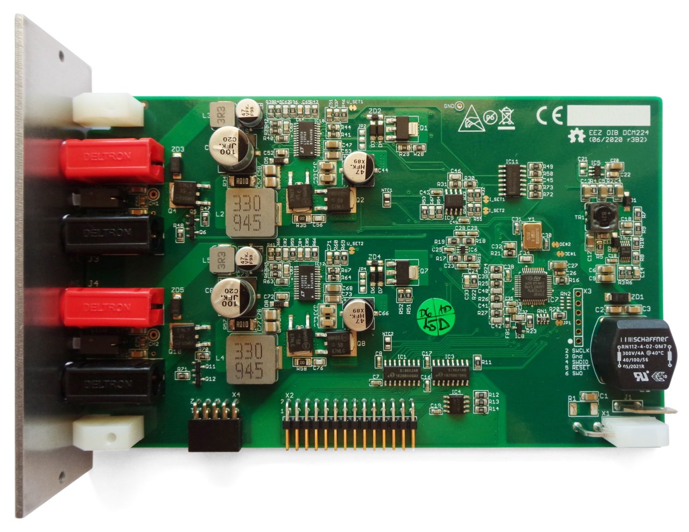

### Overview

The EEZ DIB DCM224 Power module features dual sync buck converters based on [LT3763](https://www.analog.com/en/products/lt3763.html) with programmable output voltage, PWM dimming and current limit.

### Feature list
- On-board STM32F373 MCU
Power input: 48 Vdc (e.g. Mean Well LRS-150F-48)
- Combined max. output power: up to 155 W
- Separate control of each power outputs
- Voltage regulation (CV), 1 – 24 V. Voltage set resolution (_U_SET_): 12-bit, read resolution (_U_MON_): 15-bit
- Current regulation (CC), up to 4.9 A. Current set resolution (_I_SET_): 12-bit, read resolution (_I_MON_): 15-bit
- PWM LED dimming
- MCU generated two counterphase switching frequencies
- On-board power pre-regulator and bias power supply
- Output Enable (_OE_) and Constant Current mode (_CC_) LED indications
- Output LC filter for improved ripple and noise
- On-board 4 mm power output terminals with standard (19.05 mm) pitch
- Pass-thru connector for Vout- coupling with other DIB power modules
- Galvanically isolated SPI bus for communication with [MCU board](https://github.com/eez-open/modular-psu/tree/master/mcu)
- I2C EEPROM for storing board specific configuration and calibration parameters
- Dimensions: 155 x 95 mm, 4-layer PCB
